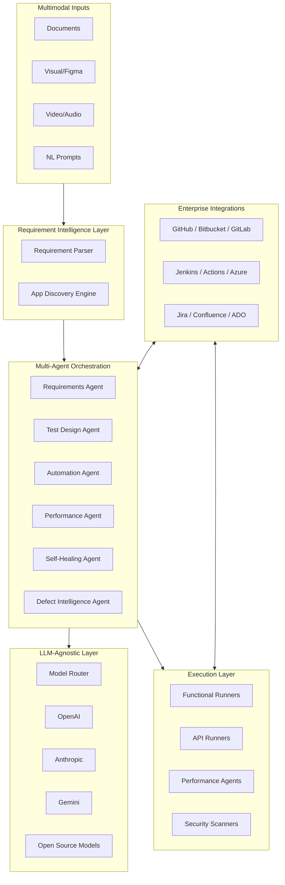

# QEOS Architecture

## System Overview



## Design Principles

1. **Framework-agnostic** — Canonical test representation; adapters emit Selenium, Playwright, k6, etc.
2. **LLM-agnostic** — Unified provider interface with routing, fallback, and cost optimization.
3. **Multi-tenant SaaS** — Tenant isolation, RBAC, SSO, audit trails.
4. **Cloud-native / hybrid** — Kubernetes-ready; on-prem load agents supported.
5. **Agent orchestration** — LangGraph-style state machines with human-in-the-loop gates.

## Layer Descriptions

### Requirement Intelligence Layer

Ingests BRD, FRD, PRD, user stories, Jira epics, Figma exports, and multimodal inputs. Produces structured requirement graphs linked to acceptance criteria and risk scores.

### Autonomous Application Discovery

Given URL + credentials + requirements:

- Auto-login and flow exploration
- Screen inventory, API inventory, dependency graph
- Critical journey identification and coverage matrix

### Test Design Intelligence

Generates scenarios, cases, suites, regression/smoke packs with requirement, risk, flow, and release coverage tracking.

### Automation Generation Engine

Framework and language adapters:

| Framework | Languages |
|-----------|-----------|
| Selenium, Playwright, Cypress, Appium, WebDriverIO, Robot | Java, Python, JS, TS, C# |

Outputs: page objects, reusable components, test data, CI pipelines.

### Performance Engineering

- Workload models from functional flows (e.g., Flow A 50%, B 30%, C 20%)
- JMeter, k6, Gatling, Locust script generation
- Distributed load: controller + auto-scaling load agents

### Self-Healing

- UI: locators, XPath, CSS
- API: endpoint/schema drift
- Performance: correlations, tokens, session IDs

### Environment Management

Profiles for DEV → PROD with secrets, config templates, and cross-environment portability (scripts unchanged).

## Data Model (Core Entities)

```
Tenant → Organization → Project → Workspace
Project → Requirements → TestCases → TestSuites
Project → AutomationAssets → Executions → Results
Project → Integrations (Git, Jira, CI/CD)
Project → Environments → Secrets
AgentRun → AgentStep → Artifacts
```

## Security & Governance

- RBAC roles: Platform Admin, Enterprise Admin, Project Admin, Tester, Automation/Performance/Security Engineer, Business User
- SSO (SAML/OIDC), audit logs, approval workflows
- Compliance targets: SOC2, ISO27001, GDPR, HIPAA

## Deployment Topology

```
┌─────────────────────────────────────────┐
│  QA Studio (Next.js)                    │
├─────────────────────────────────────────┤
│  API Gateway (FastAPI)                  │
├──────────┬──────────┬───────────────────┤
│ Agents   │ Workers  │ Integration Hub   │
├──────────┴──────────┴───────────────────┤
│  PostgreSQL  │  Redis  │  Object Storage │
└─────────────────────────────────────────┘
         │                    │
    Load Controller      Load Agents (K8s / on-prem)
```

## Phase 1 Implementation Scope

Current scaffold delivers:

- FastAPI backend with health, projects, agents, integrations APIs
- LLM provider abstraction (OpenAI, Anthropic, Gemini, Ollama)
- Agent registry and orchestrator skeleton
- GitHub, Bitbucket, GitLab, Gitea integration connectors
- CI/CD webhook handlers (GitHub Actions, GitLab, Jenkins)
- QA Studio frontend shell with dashboard and integration setup
